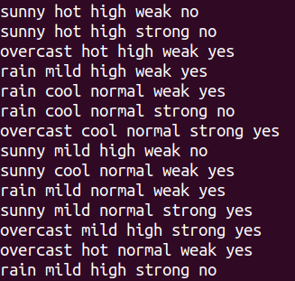
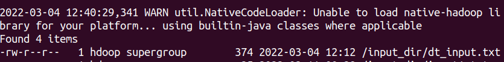
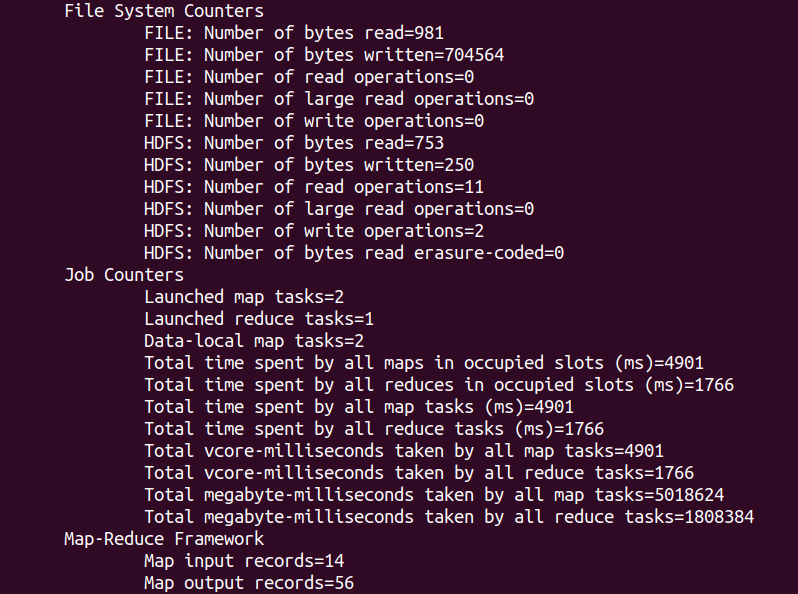
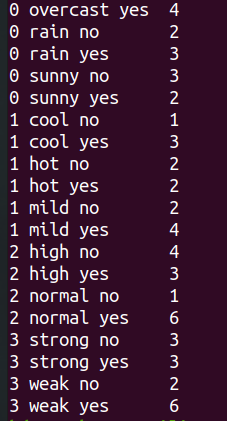

# Decision Tree USING MAPREDUCE - Assignment 4

## JAVA Code


### Split.java

```java
import java.util.ArrayList;
import java.util.List;

public class Split implements Cloneable{
    public List attr_index;
    public List attr_value;
    double entophy;
    String classLabel;
    
    Split(){
        this.attr_index= new ArrayList<Integer>();
        this.attr_value = new ArrayList<String>();
    }

    Split(List attr_index,List attr_value){
        this.attr_index=attr_index;
        this.attr_value=attr_value;
    }

    void add(Split obj){
        this.add(obj);
    }
}
```
### GainRatio.java

```
import java.io.*;
import java.util.*;
import java.lang.Math;

 class GainRatio
 {
	   
	 int linenumber=0;
	  static String count[][]=new String[1000][4];
	  int currnode[]=new int[100];
	  String majorityLabel=null;
	  public String majorityLabel()
	  {
		  return majorityLabel;
	  }

	//Calculation of entrophy
	  public double currNodeEntophy()
	  {
		  int currentindex=0;
		  double entropy=0;
		  currentindex=Integer.parseInt(count[0][0]);
		  int i=0;
		  int covered[]=new int[1000];
		  String classLabel=count[0][2];
		   int j=0;
		   int ind=-1;
		   int maxStrength=0;
		   System.out.println("Values in node rep to classwise");
		  while(currentindex==Integer.parseInt(count[j][0]))
		  {
			  if(covered[j]==0)
		      {
				  classLabel=count[j][2];
				  	ind++;
		            i=j;
				  while(currentindex==Integer.parseInt(count[i][0]))
				  {   if(covered[i]==0)
				  		{
			  				if(classLabel.contentEquals(count[i][2]))
			  				{
			  					currnode[ind]=currnode[ind]+Integer.parseInt(count[i][3]);
			  					covered[i]=1;
			  				}
			  			
				  		}
		  			i++;
		  			if(i==linenumber)
						  break;
				  }
				  if(currnode[ind]>maxStrength)
				  {
					  maxStrength=currnode[ind];
					  majorityLabel=classLabel;
				  }
				  System.out.print("    "+classLabel+"    "+currnode[ind]);
		       }
			  else
			  {
				j++;
			  }
			  if(j==linenumber)
				  break;
		  
		  }
		  entropy=entropy(currnode);
		  
		  return entropy;
		  
	  }
	  public double entropy(int c[])
	  {
		  double entropy=0;
		
		  int i=0;
		  int sum=0;
		  double frac;
		  while(c[i]!=0)
		  {
			 sum=sum+c[i];
			 i++;
		  }
		  i=0;
		  while(c[i]!=0)
		  {
			  
			  frac=(double)c[i]/sum;
		  
			  entropy=entropy-frac*(Math.log(frac)/Math.log(2));
			  i++;
		  }
		
		  return entropy;
	  }
	  
	  
	  
	  public void getcount()
	  { 
	  C45 id=new C45();
	  FileInputStream fstream;
	try {
		
		fstream = new FileInputStream("/home/hdoop/hadoop-3.2.2/sbin/pack/output/intermediate"+id.current_index+".txt");
			
		  DataInputStream in = new DataInputStream(fstream);
		  BufferedReader br = new BufferedReader(new InputStreamReader(in));
		  String line;
		  //Read File Line By Line
		  StringTokenizer itr;
		// System.out.println("READING FROM intermediate  "+id.current_index);
		  
		  while ((line = br.readLine()) != null)   {
			  itr= new StringTokenizer(line);
			  count[linenumber][0]=itr.nextToken();
			  count[linenumber][1]=itr.nextToken();
			  count[linenumber][2]=itr.nextToken();
			  count[linenumber][3]=itr.nextToken();
			  int i=linenumber;
			
			  linenumber++;
		    }
		  count[linenumber][0]=null;
		  count[linenumber][1]=null;
		  count[linenumber][2]=null;
		  count[linenumber][3]=null;
		  in.close();
		  
	} catch (Exception e) {
		// TODO Auto-generated catch block
		e.printStackTrace();
	    	  
	    	  //Close the input stream
	}
	  
  }
	  
	  
	  
	  public double gainratio(int index,double enp)
	  {
		  
		//100 is considered as max ClassLabels
		  int c[][]=new int[1000][100];
		  int sum[]=new int[1000]; //
		  String currentatrrval="@3#441get";
		  double gainratio=0;
		  int j=0;
		  int m=-1;  //index for split number 
		  int lines=linenumber;
		  int totalsum=0;
		  for(int i=0;i<lines;i++)
		  {
			  if(Integer.parseInt(count[i][0])==index)
			  {
				  
				  
	    		  if(count[i][1].contentEquals(currentatrrval))
	    		  {
	    		  j++;
	    		  c[m][j]=Integer.parseInt(count[i][3]);
	    		  sum[m]=sum[m]+c[m][j];
	    		  }
	    		  else
	    		  {
	    			  j=0;
	    			  m++;
	    			  currentatrrval=count[i][1];
	    			  c[m][j]=Integer.parseInt(count[i][3]); //(different class) data sets count per m index split
	    			  sum[m]=c[m][j];
	    		  }
	    	       
			  }
		  }
		  int p=0;
		  while(sum[p]!=0)
		  {
		  totalsum=totalsum+sum[p]; //calculating total instance in node
		  p++;
		  }
		
		  double wtenp=0;
		  double splitenp=0;
		  double part=0;
		  for(int splitnum=0;splitnum<=m;splitnum++)
		  {
			  part=(double)sum[splitnum]/totalsum;
			 wtenp=wtenp+part*entropy(c[splitnum]);
		  }
		  splitenp=entropy(sum);
		  gainratio=(enp-wtenp)/(splitenp);
		  return gainratio;
		  
	  }
	  
	  
	  public String getvalues(int n)
		 {   int flag=0;
			 String values="";
			 String temp="%%%%%!!@";
			 for(int z=0;z<1000;z++)
			 {
			  if(count[z][0]!=null)
			  {
			if(n==Integer.parseInt(count[z][0]))
			 {
				 flag=1;
				
				 if(count[z][1].contentEquals(temp))
				 {
	           // System.out.println("Equals  COUNT  Index z "+z+"   "+count[z][1]+ "temp  "+temp);
				 }
				 else
				 {
					
					 values=values+" "+count[z][1];
					 temp=count[z][1];
					 
				 }
			 }
			else if(flag==1)
				break;
			}
			else
				break;
			 }
			 return values;
			 
		 }
	  
}


```

### MapClass.java
```
import java.io.IOException;
import java.util.StringTokenizer;
import org.apache.hadoop.io.IntWritable;
import org.apache.hadoop.io.LongWritable;
import org.apache.hadoop.io.Text;
import org.apache.hadoop.mapred.MapReduceBase;
import org.apache.hadoop.mapred.Mapper;
import org.apache.hadoop.mapred.OutputCollector;
import org.apache.hadoop.mapred.Reporter;

public class MapClass extends MapReduceBase
implements Mapper<LongWritable, Text, Text, IntWritable> {

private final static IntWritable one = new IntWritable(1);
private Text attValue = new Text();
private Text cLabel = new Text();
private int i;
private String token;
public static int no_Attr;
//public static int splitAttr[];
private int flag=0;


public void map(LongWritable key, Text value,OutputCollector<Text, IntWritable> output,Reporter reporter) throws IOException {

  C45 id=new C45();
  Split split=null;
  int size_split=0;
  split=id.currentsplit;
  
  String line = value.toString();      //changing input instance value to string
  StringTokenizer itr = new StringTokenizer(line);
  int index=0;
  String attr_value=null;
  no_Attr=itr.countTokens()-1;
  String attr[]=new String[no_Attr];
  boolean match=true;
  for(i =0;i<no_Attr;i++)
  {
	  attr[i]=itr.nextToken();		//Finding the values of different attributes
  }
  String classLabel=itr.nextToken();
  size_split=split.attr_index.size();
  for(int count=0;count<size_split;count++)
  {
	  index=(Integer) split.attr_index.get(count);
	  attr_value=(String)split.attr_value.get(count);
	 if(attr[index].equals(attr_value))   //may also use attr[index][z][1].contentEquals(attr_value)
	 {
		 //System.out.println("EQUALS IN MAP  nodes  "+attr[index]+"   inline  "+attr_value);
	 }
	 else
	 {
		// System.out.println("NOT EQUAL IN MAP  nodes  "+attr[index]+"   inline  "+attr_value);
		 match=false;
		 break;
	 }
	  
  }
  
  
  //id.attr_count=new int[no_Attr];

  if(match)
  {
	  for(int l=0;l<no_Attr;l++)
	  {  
		  if(split.attr_index.contains(l))
		  {
			  
		  }
		  else
		  {
			  token=l+" "+attr[l]+" "+classLabel;
			  attValue.set(token);
			  output.collect(attValue, one);
		  }
	 
  	}
	  if(size_split==no_Attr)
	  {
		  token=no_Attr+" "+"null"+" "+classLabel;
		  attValue.set(token);
		  output.collect(attValue, one);
	  	}
   }
 }
  
}
```

### Reduce.java
```
import java.io.BufferedWriter;
import java.io.File;
import java.io.FileWriter;
import java.io.IOException;
import java.util.ArrayList;
import java.util.Iterator;
import java.util.List;
import java.util.StringTokenizer;
import org.apache.hadoop.io.IntWritable;
import org.apache.hadoop.io.Text;
import org.apache.hadoop.io.Writable;
import org.apache.hadoop.mapred.MapReduceBase;
import org.apache.hadoop.mapred.OutputCollector;
import org.apache.hadoop.mapred.Reducer;
import org.apache.hadoop.mapred.Reporter;

public  class Reduce extends MapReduceBase
implements Reducer<Text, IntWritable, Text, IntWritable> {
	

public void reduce(Text key, Iterator<IntWritable> values,
                   OutputCollector<Text, IntWritable> output,
                   Reporter reporter) throws IOException {
  int sum = 0;
  String line = key.toString();
  StringTokenizer itr = new StringTokenizer(line);
  while (values.hasNext()) {
    sum += values.next().get();
  }
    output.collect(key, new IntWritable(sum));
	  writeToFile(key+" "+sum);
	  int index=Integer.parseInt(itr.nextToken());
	  String value=itr.nextToken();
	  String classLabel=itr.nextToken();
	  int count=sum;
	
 }

public static void writeToFile(String text) {
    try {
    	
    	C45 id=new C45();

    	BufferedWriter bw = new BufferedWriter(new FileWriter(new File("/home/hdoop/hadoop-3.2.2/sbin/pack/output/intermediate"+id.current_index+".txt"), true));    
    	bw.write(text);
            bw.newLine();
            bw.close();
    } catch (Exception e) {
    }
}

}

```
### C45.java
```
import java.io.BufferedWriter;
import java.io.File;
import java.io.FileWriter;
import java.io.IOException;
import java.util.ArrayList;
import java.util.Iterator;
import java.util.List;
import java.util.StringTokenizer;
import org.apache.hadoop.io.IntWritable;
import org.apache.hadoop.io.Text;
import org.apache.hadoop.io.Writable;
import org.apache.hadoop.mapred.MapReduceBase;
import org.apache.hadoop.mapred.OutputCollector;
import org.apache.hadoop.mapred.Reducer;
import org.apache.hadoop.mapred.Reporter;

public  class Reduce extends MapReduceBase
implements Reducer<Text, IntWritable, Text, IntWritable> {
	

public void reduce(Text key, Iterator<IntWritable> values,
                   OutputCollector<Text, IntWritable> output,
                   Reporter reporter) throws IOException {
  int sum = 0;
  String line = key.toString();
  StringTokenizer itr = new StringTokenizer(line);
  while (values.hasNext()) {
    sum += values.next().get();
  }
    output.collect(key, new IntWritable(sum));
	  writeToFile(key+" "+sum);
	  int index=Integer.parseInt(itr.nextToken());
	  String value=itr.nextToken();
	  String classLabel=itr.nextToken();
	  int count=sum;
	
 }

public static void writeToFile(String text) {
    try {
    	
    	C45 id=new C45();

    	BufferedWriter bw = new BufferedWriter(new FileWriter(new File("/home/hdoop/hadoop-3.2.2/sbin/pack/output/intermediate"+id.current_index+".txt"), true));    
    	bw.write(text);
            bw.newLine();
            bw.close();
    } catch (Exception e) {
    }
}

}
```


### Creating the JAR FILE
```bash
$ ../bin/hadoop com.sun.tools.javac.Main *.java
$ jar cf DT.jar *.class
```


### Input Files
```bash
$ cat dt_input.txt
```




<br>

### Ingesting Input to HDFS
```bash
$ hadoop fs -put dt_input.txt /input_dir/
```


<br>

### Running MapReduce
```bash
$ hadoop jar DT.jar C45 /input_dir/dt_input.txt /output2
```


### Output File
```bash
$ hadoop fs -cat /output2/part-00000
```
