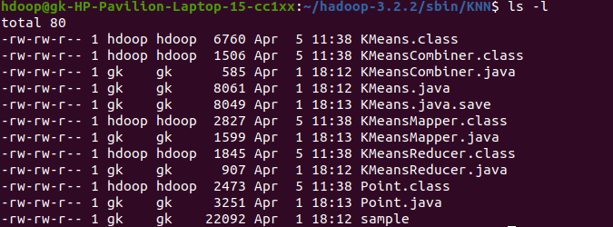
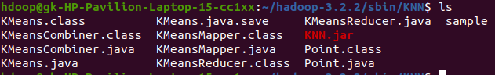
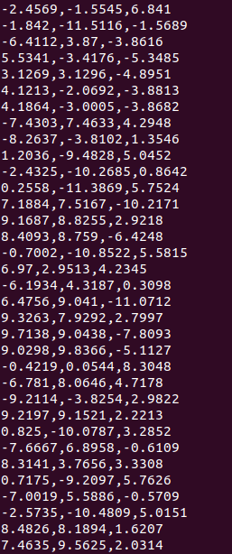
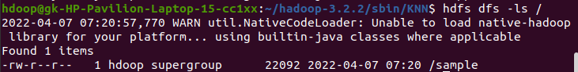
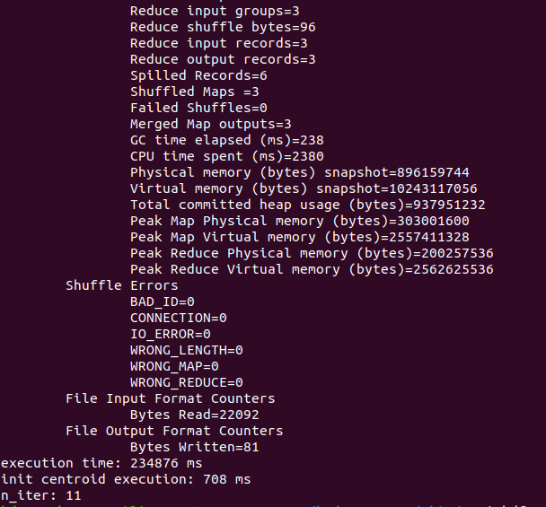
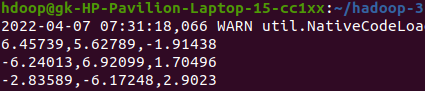

# K MeansClustering


### Creating the JAR FILE
```bash
$ ../bin/hadoop com.sun.tools.javac.Main *.java
```


```bash
$ jar cf KNN.jar *.class
```


<br>

### Input Files
```bash
$ vi input.txt
```




<br>

### Ingesting Input to HDFS
```bash
$ hadoop fs -put sample /
```


<br>

### Running MapReduce
```bash
$ hadoop jar KNN.jar KMeans /sample /output
```


### Output File
```bash
$ hadoop fs -cat /output/centroids.txt
```
