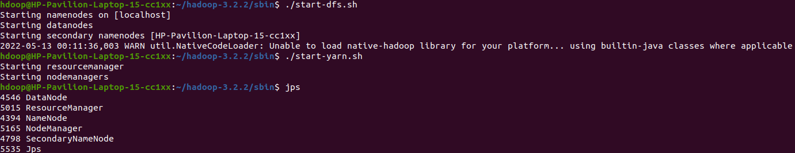
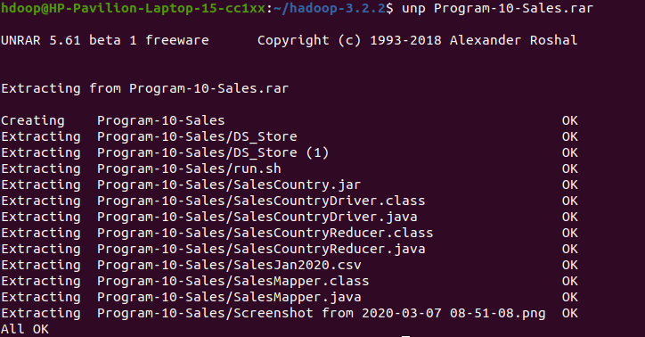
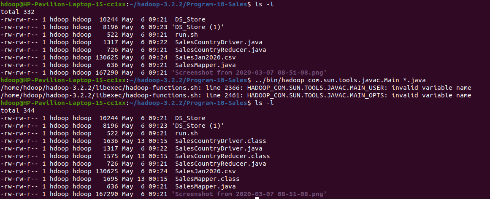
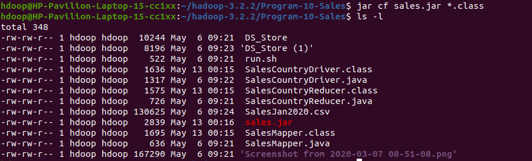
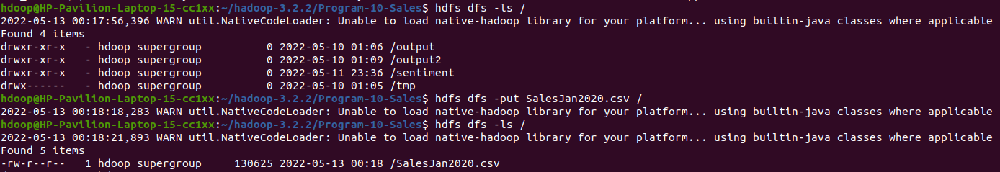
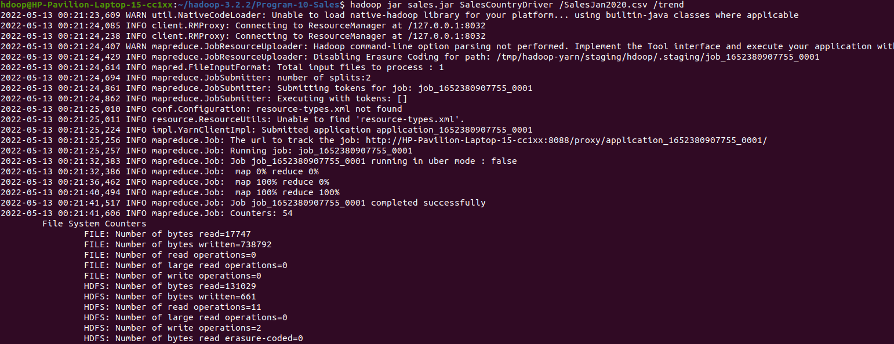
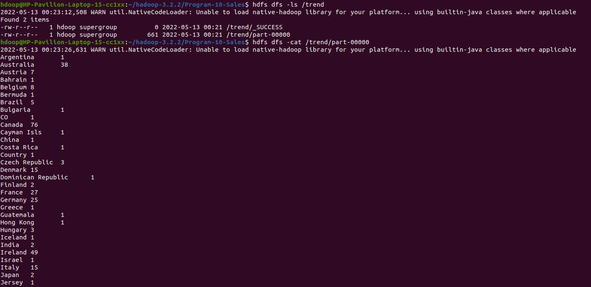

# Trend Analysis based on Access Pattern over Web Logs using Hadoop.

## Starting Hadoop Services

 

## Unzipping the File

 

## Creating the Class Files & JAR FILE

 

## Ingesting Files into HDFS

 

## Output FIles

 
