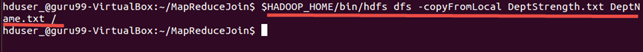
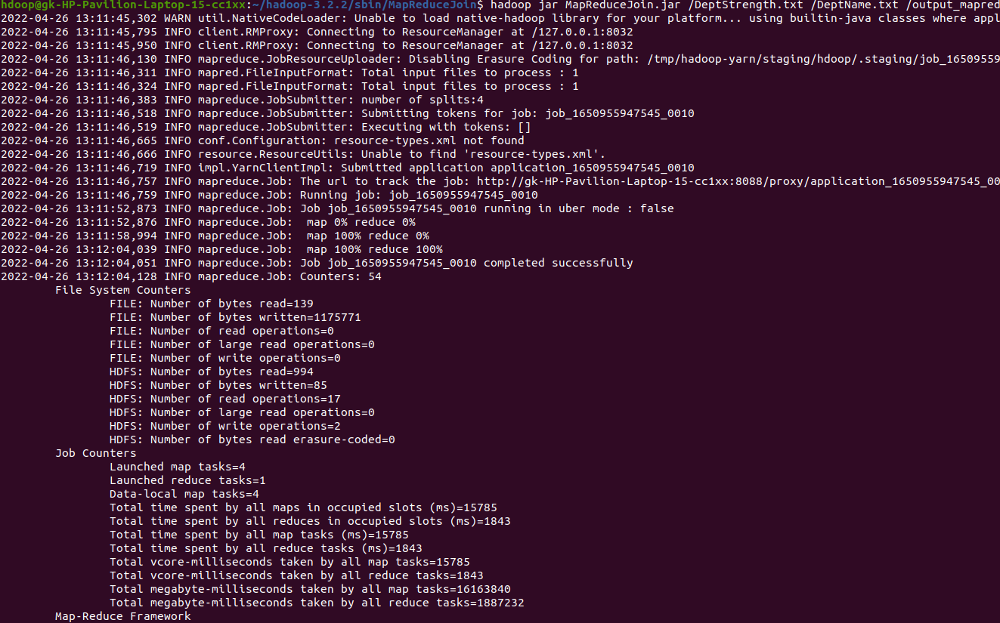
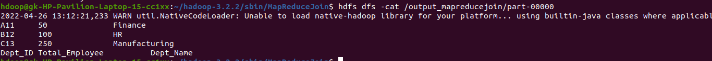

# Count the number of missing and invalid values by joining two large given datasets


### Coping from local
```bash
$ hdfs dfs -copyFromLocal DeptStrength.txt DeptName.txt /
```



### Creating the JAR File
```bash
$ hadoop jar MapReduceJoin.jar MapReduceJoin/JoinDriver/DeptStrength.txt /DeptName.txt /output_mapreducejoin
```




<br>

### Output File
```bash
$ hdfs dfs -cat /output_mapreducejoin/part-00000

```
