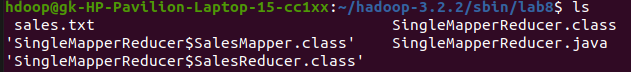
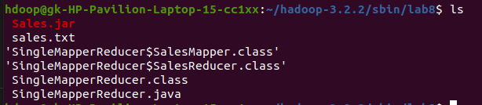
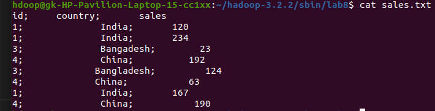
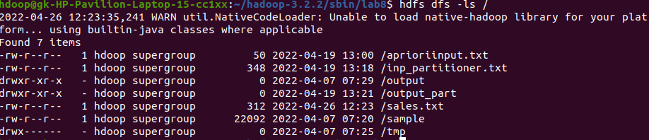
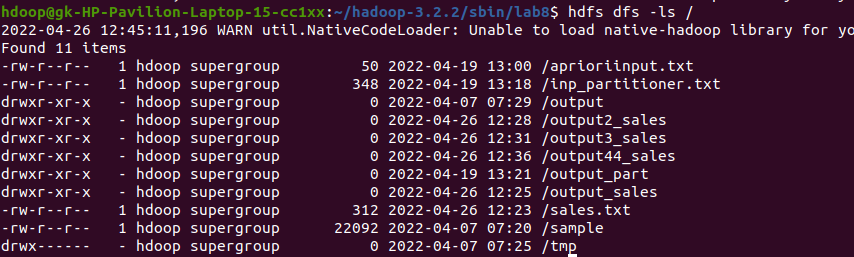

# Evaluating Number of Products Sold in Each Country in the online shopping portal


### Creating the JAR FILE
```bash
$ ../bin/hadoop com.sun.tools.javac.Main *.java
```


```bash
$ jar cf KNN.jar *.class
```


<br>

### Input Files
```bash
$ cat sales.txt
```




<br>

### Ingesting Input to HDFS
```bash
$ hadoop fs -put sample /
```


<br>

### Running MapReduce
```bash
$ hadoop jar Sales.jar SingleMapperReducer /sample /output
```


### Output File
```bash
$ hadoop fs -cat /output

```
