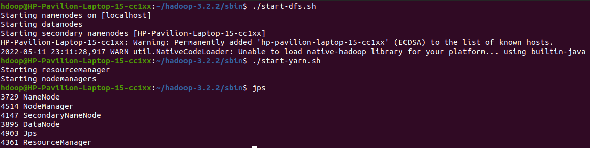

# Analyze the sentiment for product reviews, this work proposes a MapReduce technique provided by Apache Hadoop

## Starting Hadoop Services

 

## Unzipping the File

 

## Creating the Class Files & JAR FILE

 

## Ingesting Files into HDFS

 

## Output FIles

 

## Output

The positive review had a rating of 4.67. The negative review had a rating of 1.8. Thus, the
ratings returned for both reviews were accurate.