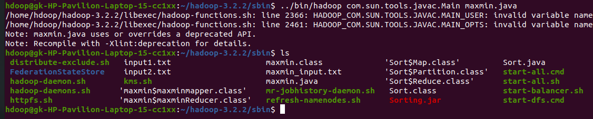
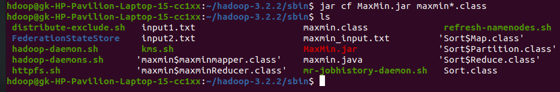
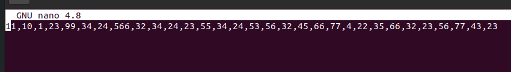
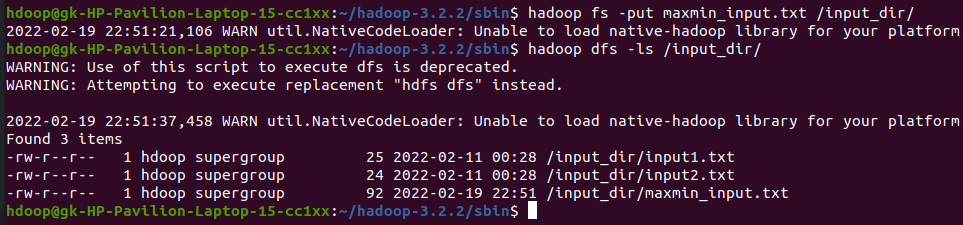
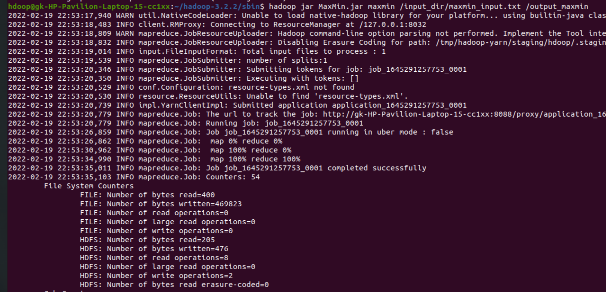
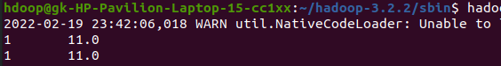

# SORTING USING MAPREDUCE - Assignment 2

### JAVA Code
```java
import java.io.IOException;
import java.util.StringTokenizer;
import java.util.Iterator;
import org.apache.hadoop.conf.Configuration;
import org.apache.hadoop.fs.Path;
import org.apache.hadoop.fs.FileSystem;
import org.apache.hadoop.io.IntWritable;
import org.apache.hadoop.io.DoubleWritable;
import org.apache.hadoop.io.LongWritable;
import org.apache.hadoop.io.Text;
import org.apache.hadoop.mapreduce.Job;
import org.apache.hadoop.mapreduce.Mapper;
import org.apache.hadoop.mapreduce.Reducer;
import org.apache.hadoop.mapreduce.lib.input.FileInputFormat;
import org.apache.hadoop.mapreduce.lib.output.FileOutputFormat;
import org.apache.hadoop.mapreduce.lib.output.TextOutputFormat;
import org.apache.hadoop.mapreduce.lib.input.TextInputFormat;

public class maxmin {
    public static class maxminmapper extends Mapper<LongWritable, Text, Text, DoubleWritable> {
        
        Text t1 = new Text();
        
        public void map(LongWritable key, Text value, Context context) throws IOException, InterruptedException {
            
            String[] colvalue = value.toString().split(",");
            for (int i = 0; i < colvalue.length; i++){
                t1.set(String.valueOf(i + 1));
                context.write(t1, new DoubleWritable(Double.parseDouble(colvalue[i])));
            }
        }
    }

    public static class maxminReducer extends Reducer<Text, DoubleWritable, Text, DoubleWritable> {
        public void reduce(Text key, Iterable<DoubleWritable> values, Context context) throws IOException, InterruptedException {
            double min = Integer.MAX_VALUE, max = 0;
            Iterator<DoubleWritable> iterator = values.iterator(); //Iterating
            
            while (iterator.hasNext()){
                double value = iterator.next().get();
                
                if(value < min) { //Finding min value
                    min = value;    
                }
                
                if (value > max) { //Finding max value
                    max = value;
                }
            }

            context.write(new Text(key), new DoubleWritable(min));
            context.write(new Text(key), new DoubleWritable(max));
        } 
    }

    public static void main(String[] args) throws Exception {
    Configuration conf = new Configuration();
    Job job = new Job(conf, "Find Minimum and Maximum");
    job.setJarByClass(maxmin.class);
    job.setOutputKeyClass(Text.class);
    job.setOutputValueClass(DoubleWritable.class);
    job.setMapperClass(maxminmapper.class);
    job.setReducerClass(maxminReducer.class);
    job.setInputFormatClass(TextInputFormat.class);
    job.setOutputFormatClass(TextOutputFormat.class);
    FileInputFormat.addInputPath(job, new Path(args[0]));
    FileOutputFormat.setOutputPath(job, new Path(args[1]));
    System.exit(job.waitForCompletion(true) ? 0 : 1);
    
    }
}
```


### Creating the JAR FILE
```bash
$ ../bin/hadoop com.sun.tools.javac.Main maxmin.java
```


```bash
$ jar cf MaxMin.jar maxmin*.class
```


<br>

### Input Files
```bash
$ vi maxmin_input.txt
```




<br>

### Ingesting Input to HDFS
```bash
$ hadoop fs -put input1.txt /input_dir/maxmin_input.txt
```


<br>

### Running MapReduce
```bash
$ hadoop jar MaxMin.jar maxmin /input_dir/maxmin_input.txt /output2
```


### Output File
```bash
$ hadoop fs -cat /output2/part-r-00000
```
