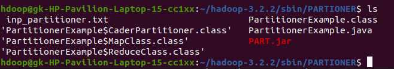
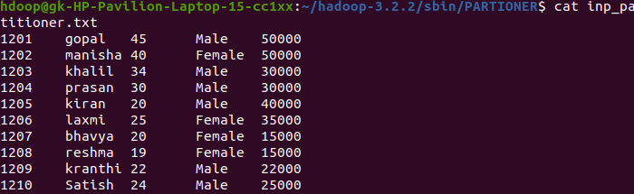
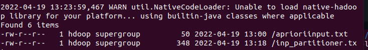
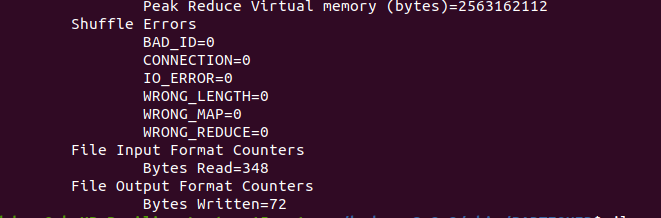
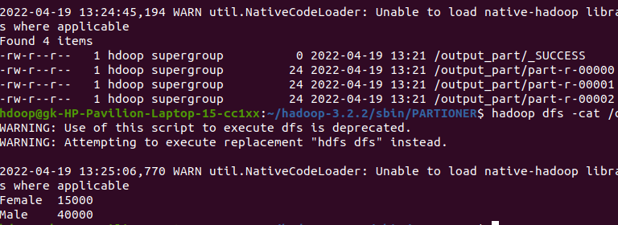

# Partitioner Example Program


### Creating the JAR FILE
```bash
$ ../bin/hadoop com.sun.tools.javac.Main *.java
```
```bash
$ jar cf PART.jar *.class
```


<br>

### Input Files
```bash
$ vi inp_partitioner.txt
```




<br>

### Ingesting Input to HDFS
```bash
$ hadoop fs -put inp_partitioner.txt /
```


<br>

### Running MapReduce
```bash
$ hadoop jar PART.jar PartitionerExample /sample /output
```


### Output File
```bash
$ hadoop fs -cat /output_part/part-r-00000.txt
```
