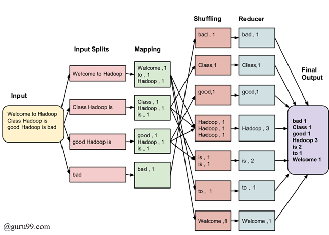

# Date : 4th Jan 2022


## Items to Install
1. Ubuntu : Operating System (Preferably Dual Boot if you use windows)
2. Java JDK : Programming Language
3. Hadoop : Tool Package for OLAP

## Download Links
- https://ubuntu.com/download/desktop
- https://www.oracle.com/java/technologies/downloads/
- https://hadoop.apache.org/releases.html

## Some Terminologies
1. NameNode : keeps the directory tree of all files in the file system, and tracks where across the cluster the file data is kept
2. Secondary NN :takes checkpoints of the file system metadata present on namenode
3. DataNode : block server that stores the data in the local file
4. Distributed COmputing : Hadoop is a popular open source distributed computing platform under the Apache Software Foundation. It distributes wirks accross various datanode.
5. Key : unique id that identifies tasks
6. Map : Map takes a set of data and converts it into another set of data, where individual elements are broken down into keys.
7. Reduce : combines all outputs of small tasks and gives final output.
8. Node Manneger : monitoring their resource usage and reporting the same to the ResourceManager.
9. Resource Manager : allocates resources like memory, cpu etc. It manages the use of resources across the cluster

## Start Hadoop
```bash
$ start-dfs.sh
$ start-yarn.sh
```

## Invention of Benzene Structure (dreams come true)


## Six Things that should run
- Name Node
- Secondary Name Node
- Node Manager
- Resourse Manager
- Data Node
- Job Process Scheduler (JPS)

## What is Single Cluster Hadoop ?
It has 1 Name Node, 1 Secondary Name Node, Data Node.


### How to compile Hadoop Job?
- Write the program lets say fraud_det.java
- $ javac fraud_det.java
- Create jar file
- Run the Jar file

### Some Extra Terminologies
- HDFS : Hadoop Distributed File System
- YARN : Yet Another Resourse Negotiater

# Date : 5th Jan 2022


## Installation Guide
### Step 1 : Update sudo
```bash
$ sudo apt-get-update
```
### Step 2 : Install JDK
```bash
$ sudo apt-get install default-jdk
$ java -version
```

### Step 3 : Hadoop
```bash
$ sudo addgroup hadoop
$ sudo adduser --ingroup hadoop hduser
```

### Step 4 : SSH
```bash
$ sudo apt-get install ssh
$ which ssh
$ which sshd
```


### Step 5 : Login to Hadoop User
```bash
$ su hduser
$ sudo adduser hduser sudo
$ sudo ssh-keygen -t rsa -P ""
```

### Step 6 : Hadoop Installation
```
Download and Unzip the folder , rename it as hadoop and put it in usr/local/
Dont just copy paste, use mvdir
```


# Guide

## Dual Booting System
### Youtube Video 
<center>
<a href="https://youtu.be/xnisuFk-cDg">Youtube Video for Dual Boot</a><br>
<a href="https://towardsdatascience.com/how-to-dual-boot-windows-10-and-linux-ubuntu-20-04-lts-in-a-few-hassle-free-steps-f0e465c3aafd">Page Link</a>
<br>
</center>


### Downloadable Links
- https://ubuntu.com/download/desktop
- https://rufus.ie/en/

## Installing Hadoop
<a href="https://phoenixnap.com/kb/install-hadoop-ubuntu">Refer this link</a>


# Date : 11th Jan 2022

## Frontend, Backend & MiddleWare
- Front end relates to the Software’s presentation layer, essentially the user interface (UI) and User Experience (UX). This is basically what elements of the software are visible by the end user and what their interactions with the system will be. 
- Back end relates to the Software’s data tier or persistence layer. Typically this is the database(s) that the software is built on which is not directly presented to the user. So once a user requests data, clicks on an option or issues a command of some sort through the UI, this is where the data is stored, found by the software, retrieved and then displayed back to the user
- Middleware is referred to as middle tier. Essentially Middleware links the front and back end of the system together acting as a bridge between the front and back end. It is often referred to as the glue between the data and the UI.

<center>
    
</center>

## 5V of Big Data
<center>
    
</center>

- Volume : Volume refers to the unimaginable amounts of information generated every second from social media, cell phones, cars, credit cards.
- Variety : As Discussed before, Big Data is generated in multiple varieties. Compared to the traditional data like phone numbers and addresses, the latest trend of data is in the form of photos, videos, and audios and many more, making about 80% of the data to be completely unstructured.
- Veracity : Veracity basically means the degree of reliability that the data has to offer. Since a major part of the data is unstructured and irrelevant, Big Data needs to find an alternate way to filter them or to translate them out as the data is crucial in business developments.
- Value : Value is the major issue that we need to concentrate on. It is not just the amount of data that we store or process. It is actually the amount of valuable, reliable and trustworthy data that needs to be stored, processed, analyzed to find insights
- Velocity : Last but never least, Velocity plays a major role compared to the others, there is no point in investing so much to end up waiting for the data. So, the major aspect of Big Dat is to provide data on demand and at a faster pace.


## Advantage of Hadoop
-  Cost : Hadoop is open-source and uses cost-effective commodity hardware which provides a cost-efficient model, unlike traditional Relational databases that require expensive hardware and high-end processors to deal with Big Data. 
- Scalability : Hadoop is a highly scalable model. A large amount of data is divided into multiple inexpensive machines in a cluster which is processed parallelly. the number of these machines or nodes can be increased or decreased as per the enterprise’s requirements.
- Flexibility : Hadoop is designed in such a way that it can deal with any kind of dataset like structured(MySql Data), Semi-Structured(XML, JSON), Un-structured (Images and Videos) very efficiently. This means it can easily process any kind of data independent of its structure which makes it highly flexible.
- Speed : Hadoop uses a distributed file system to manage its storage i.e. HDFS(Hadoop Distributed File System). In DFS(Distributed File System) a large size file is broken into small size file blocks then distributed among the Nodes available in a Hadoop cluster, as this massive number of file blocks are processed parallelly which makes Hadoop faster, because of which it provides a High-level performance as compared to the traditional DataBase Management Systems. 
When you are dealing with a large amount of unstructured data speed is an important factor, with Hadoop you can easily access TB’s of data in just a few minutes.

-  Fault Tolerance : Hadoop uses commodity hardware(inexpensive systems) which can be crashed at any moment. In Hadoop data is replicated on various DataNodes in a Hadoop cluster which ensures the availability of data if somehow any of your systems got crashed.

- High Throughput : Hadoop works on Distributed file System where various jobs are assigned to various Data node in a cluster, the bar of this data is processed parallelly in the Hadoop cluster which produces high throughput. Throughput is nothing but the task or job done per unit time.

- Minimum Network Traffic : In Hadoop, each task is divided into various small sub-task which is then assigned to each data node available in the Hadoop cluster. Each data node process a small amount of data which leads to low traffic in a Hadoop cluster.

## Map Reduce
- MapReduce is a processing technique and a program model for distributed computing based on java. The MapReduce algorithm contains two important tasks, namely Map and Reduce.
1.  Map takes a set of data and converts it into another set of data, where individual elements are broken down into tuples.

2. Reduce takes the output from a map as an input and combines those data tuples into a smaller set of tuples

<center>
    
    <a href="https://www.talend.com/resources/what-is-mapreduce/">Read More Here</a>
</center>
<br>
- The major advantage of MapReduce is that it is easy to scale data processing over multiple computing nodes. Under the MapReduce model, the data processing primitives are called mappers and reducers. 

