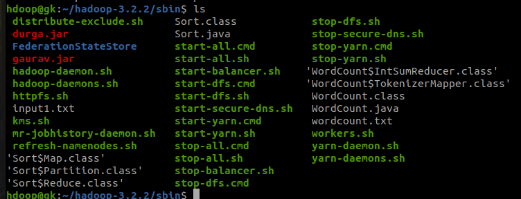
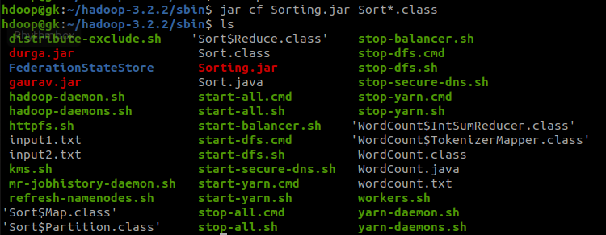
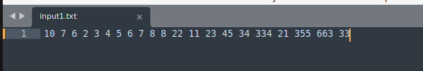
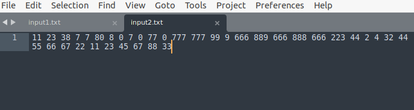
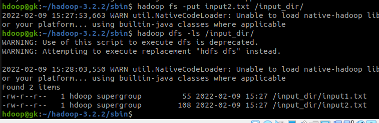
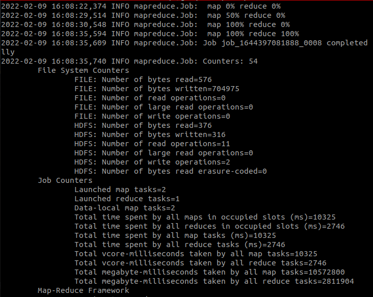
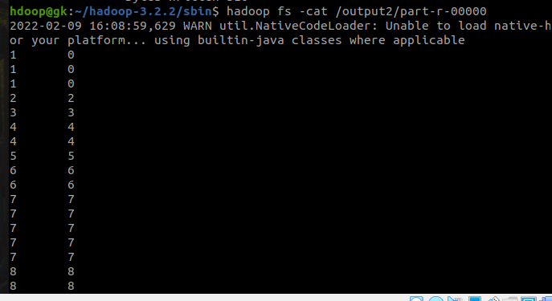

# SORTING USING MAPREDUCE - Assignment 2

### JAVA Code
```java
import org.apache.hadoop.conf.Configuration;
import org.apache.hadoop.fs.Path;
import org.apache.hadoop.io.IntWritable;
import org.apache.hadoop.io.Text;
import org.apache.hadoop.mapreduce.Job;
import org.apache.hadoop.mapreduce.Mapper;
import org.apache.hadoop.mapreduce.Partitioner;
import org.apache.hadoop.mapreduce.Reducer;
import org.apache.hadoop.mapreduce.lib.input.FileInputFormat;
import org.apache.hadoop.mapreduce.lib.input.TextInputFormat;
import org.apache.hadoop.mapreduce.lib.output.FileOutputFormat;
import org.apache.hadoop.mapreduce.lib.output.TextOutputFormat;

import java.io.IOException;

public class Sort{
    public static class Map extends Mapper<Object, Text, IntWritable, IntWritable> {
        private static IntWritable data = new IntWritable();

        @Override
        protected void map(Object key, Text value, Context context) throws IOException, InterruptedException {
            String line = value.toString();
            data.set(Integer.parseInt(line));
            context.write(data, new IntWritable(1));
        }
    }

    public static class Reduce extends Reducer<IntWritable, IntWritable, IntWritable, IntWritable> {
        private static IntWritable linenum = new IntWritable(1);

        @Override
        protected void reduce(IntWritable key, Iterable<IntWritable> values, Context context) throws IOException, InterruptedException {
            for (IntWritable val : values) {
                context.write(linenum, key);
            }
            linenum = new IntWritable(linenum.get() + 1);
        }
    }

    public static class Partition extends Partitioner<IntWritable, IntWritable>{
        @Override
        public int getPartition(IntWritable key, IntWritable value, int numPartitions) {
            int maxNum = 65223;
            int bound = maxNum / numPartitions + 1;
            int keynum = key.get();
            for(int i=0; i< numPartitions;i++){
                if(keynum< bound * i && keynum >= bound * (i-1))
                    return i-1;
            }
            return -1;
        }
    }

    public static void main(String[] args) throws Exception {
        Configuration conf = new Configuration();

        Job job = new Job(conf, "sort");
        job.setJarByClass(Sort.class);

        job.setOutputKeyClass(IntWritable.class);
        job.setOutputValueClass(IntWritable.class);

        job.setMapperClass(Map.class);
        job.setReducerClass(Reduce.class);
        job.setPartitionerClass(Partition.class);

        job.setInputFormatClass(TextInputFormat.class);
        job.setOutputFormatClass(TextOutputFormat.class);

        FileInputFormat.addInputPath(job, new Path(args[0]));
        FileOutputFormat.setOutputPath(job, new Path(args[1]));

        job.waitForCompletion(true);
    }
}

```


### Creating the JAR FILE
```bash
$ ../bin/hadoop com.sun.tools.javac.Main Sort.java
```


```bash
$ jar cf Sorting.jar Sort*.class
```


<br>

### Input Files
```bash
$ vi input1.txt
$ vi input2.txt
```





<br>

### Ingesting Input to HDFS
```bash
$ hadoop fs -put input1.txt /input_dir/
$ hadoop fs -put input2.txt /input_dir/
```


<br>

### Running MapReduce
```bash
$ hadoop jar Sorting.jar Sort /input_dir/ /output2
```


### Output File
```bash
$ hadoop fs -cat /output2/part-r-00000
```
