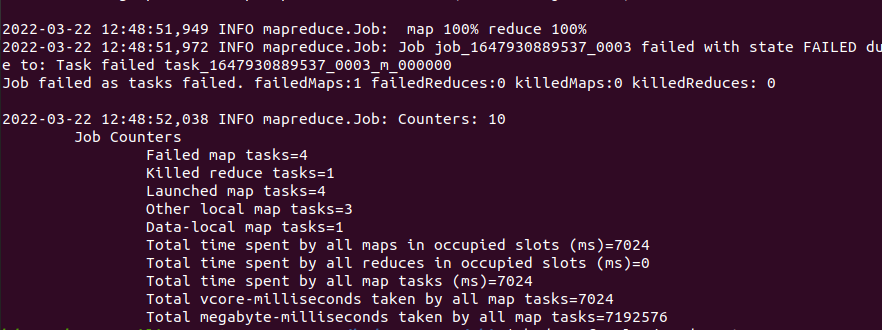

# Objective
The objective of the program is to get the sentiment of the paragraph. For that we have tried to get the words that are repeated highest number of times (except stopwords). 

# Map and Reduce
- Mapper It is the first phase of MapReduce programming and contains the coding logic of the mapper function. The conditional logic is applied to the ‘n’ number of data blocks spread across various data nodes. Mapper function accepts key-value pairs as input as (k, v), where the key represents the offset address of each record and the value represents the entire record content. The output of the Mapper phase will also be in the key-value format as (k’, v’).
- Shuffle and Sort The output of various mappers (k’, v’), then goes into Shuffle and Sort phase. All the duplicate values are removed, and different values are grouped together based on similar keys. The output of the Shuffle and Sort phase will be key-value pairs again as key and array of values (k, v[]).

- Reducer The output of the Shuffle and Sort phase (k, v[]) will be the input of the Reducer phase. In this phase reducer function’s logic is executed and all the values are aggregated against their corresponding keys. Reducer consolidates outputs of various mappers and computes the final job output. The final output is then written into a single file in an output directory of HDFS.


The wordcount program runs as follows :

<bold>Input :</bold> i am gaurav and i am from christ university

## Mapper :

i : 1

am : 1

gaurav : 1

and : 1

i : 1

am : 1

from : 1

christ : 1

university : 1

## Shuflle

i : 1

i : 1

am : 1

am : 1


gaurav : 1

and : 1

from : 1

christ : 1

university : 1

## Sort
i : [1,1]

am : [1,1]

gaurav : [1]

and : [1]

from : [1]

christ : [1]

university : [1]


# Reduce

i  2

am  2

gaurav 1

and 1

from 1

christ 1

university 1


Then we take the output of this mapreduce and form another mapreduce to sort the code
i.e Reduce (MR1) = Map (MR2)




## Code

### For creating wordcount
```
import java.io.IOException;
import java.util.StringTokenizer;

import org.apache.hadoop.conf.Configuration;
import org.apache.hadoop.fs.Path;
import org.apache.hadoop.io.IntWritable;
import org.apache.hadoop.io.Text;
import org.apache.hadoop.mapreduce.Job;
import org.apache.hadoop.mapreduce.Mapper;
import org.apache.hadoop.mapreduce.Reducer;
import org.apache.hadoop.mapreduce.lib.input.FileInputFormat;
import org.apache.hadoop.mapreduce.lib.output.FileOutputFormat;


public class WordCount 
{

  public static class TokenizerMapper extends Mapper<Object, Text, Text, IntWritable>{

    private final static IntWritable one = new IntWritable(1);
    private Text word = new Text();

    public void map(Object key, Text value, Context context) throws IOException, InterruptedException {
      StringTokenizer itr = new StringTokenizer(value.toString());
      while (itr.hasMoreTokens()) {
        word.set(itr.nextToken());
        context.write(word, one);
      }
    }
  }


  public static class IntSumReducer extends Reducer<Text,IntWritable,Text,IntWritable> {
    private IntWritable result = new IntWritable();

    public void reduce(Text key, Iterable<IntWritable> values, Context context) throws IOException, InterruptedException {
      
      int sum = 0;
      for (IntWritable val : values) {
        sum += val.get();
      }

      result.set(sum);
      context.write(key, result);


    }
  }


  public static void main(String[] args) throws Exception {
    Configuration conf = new Configuration();
    Job job = Job.getInstance(conf, "word count");
    job.setJarByClass(WordCount.class);
    job.setMapperClass(TokenizerMapper.class);
    job.setCombinerClass(IntSumReducer.class);
    job.setReducerClass(IntSumReducer.class);
    job.setOutputKeyClass(Text.class);
    job.setOutputValueClass(IntWritable.class);
    FileInputFormat.addInputPath(job, new Path(args[0]));
    FileOutputFormat.setOutputPath(job, new Path(args[1]));
    System.exit(job.waitForCompletion(true) ? 0 : 1);
  }
}
```


#### For Sorting
```
import org.apache.hadoop.conf.Configuration;
import org.apache.hadoop.fs.Path;
import org.apache.hadoop.io.IntWritable;
import org.apache.hadoop.io.Text;
import org.apache.hadoop.mapreduce.Job;
import org.apache.hadoop.mapreduce.Mapper;
import org.apache.hadoop.mapreduce.Partitioner;
import org.apache.hadoop.mapreduce.Reducer;
import org.apache.hadoop.mapreduce.lib.input.FileInputFormat;
import org.apache.hadoop.mapreduce.lib.input.TextInputFormat;
import org.apache.hadoop.mapreduce.lib.output.FileOutputFormat;
import org.apache.hadoop.mapreduce.lib.output.TextOutputFormat;

import java.io.IOException;

public class Sort{
    public static class Map extends Mapper<Object, Text, IntWritable, IntWritable> {
        private static IntWritable data = new IntWritable();

        @Override
        protected void map(Object key, Text value, Context context) throws IOException, InterruptedException {
            String line = value.toString();
            String[] l = line.split("\\s+");

            data.set(Integer.parseInt(l[1]));
            context.write(data, new IntWritable(1));
        }
    }

    public static class Reduce extends Reducer<IntWritable, IntWritable, IntWritable, IntWritable> {
        private static IntWritable linenum = new IntWritable(1);

        @Override
        protected void reduce(IntWritable key, Iterable<IntWritable> values, Context context) throws IOException, InterruptedException {
            for (IntWritable val : values) {
                context.write(linenum, key);
            }
            linenum = new IntWritable(linenum.get() + 1);
        }
    }

    public static class Partition extends Partitioner<IntWritable, IntWritable>{
        @Override
        public int getPartition(IntWritable key, IntWritable value, int numPartitions) {
            int maxNum = 65223;
            int bound = maxNum / numPartitions + 1;
            int keynum = key.get();
            for(int i=0; i< numPartitions;i++){
                if(keynum< bound * i && keynum >= bound * (i-1))
                    return i-1;
            }
            return -1;
        }
    }

    public static void main(String[] args) throws Exception {
        Configuration conf = new Configuration();

        Job job = new Job(conf, "sort");
        job.setJarByClass(Sort.class);

        job.setOutputKeyClass(IntWritable.class);
        job.setOutputValueClass(IntWritable.class);

        job.setMapperClass(Map.class);
        job.setReducerClass(Reduce.class);
        job.setPartitionerClass(Partition.class);

        job.setInputFormatClass(TextInputFormat.class);
        job.setOutputFormatClass(TextOutputFormat.class);

        FileInputFormat.addInputPath(job, new Path(args[0]));
        FileOutputFormat.setOutputPath(job, new Path(args[1]));

        job.waitForCompletion(true);
    }
}

```


## Output

love 17

thought 5

mind 4


# Analysis
The sentiment of the paragraph tells about love, peace and harmony. The highest frequesy is 51 i.e for letter the. Since its a  stopword we will not consider this so the word with highest frequency is love. The paragraph consist of several words that tells about love and peace. The speaker tries to speak about unbounded love and tells love as a healing agent.
